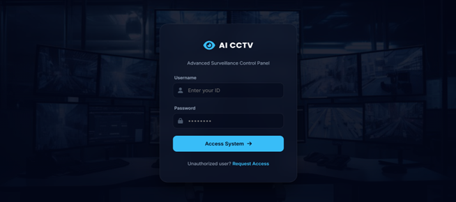
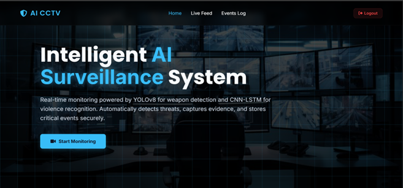
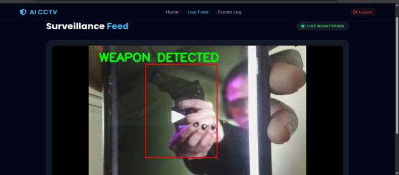
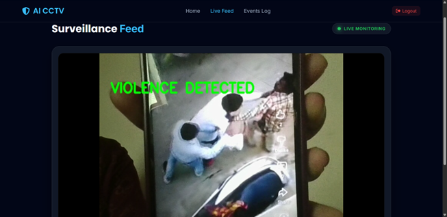
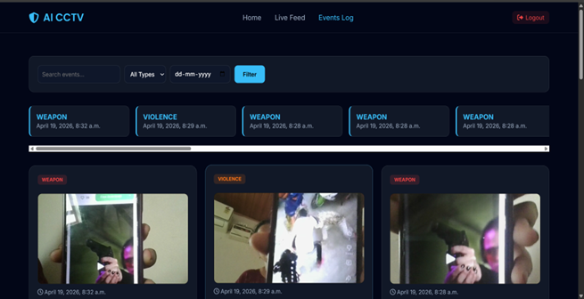

# 🔍 Surveillance System for Weapon and Violence Detection

## 📌 Overview

The **Surveillance System for Weapon and Violence Detection** is an AI-based intelligent security system developed to automatically detect dangerous weapons and violent activities from live CCTV surveillance feeds in real time.

The system integrates:

- **YOLOv8** for real-time weapon detection
- **CNN-LSTM with MobileNetV2** for violence detection
- **OpenCV** for video processing
- **Django** for monitoring dashboard
- **SQLite** for database management

The project improves public safety by reducing manual monitoring and generating automatic siren and dashboard alerts whenever threats are detected.

---

# 🚀 Features

✅ Real-time CCTV monitoring  
✅ Weapon detection using YOLOv8  
✅ Violence detection using CNN-LSTM  
✅ Bounding box localization  
✅ Siren alert generation  
✅ Dashboard alert notifications  
✅ Evidence screenshot capture  
✅ Database event storage  
✅ Intelligent threat analysis  
✅ Django web dashboard  

---

# 🧠 Technologies Used

| Component | Technology |
|---|---|
| Programming Language | Python |
| Weapon Detection | YOLOv8 |
| Violence Detection | MobileNetV2 + LSTM |
| Video Processing | OpenCV |
| Backend Framework | Django |
| Database | SQLite |
| Deep Learning Framework | TensorFlow / Keras |

---

# 🏗️ System Architecture

## Proposed Workflow

1. Live CCTV Feed  
2. Frame Extraction & Preprocessing  
3. Weapon Detection using YOLOv8  
4. Violence Detection using CNN-LSTM  
5. Threat Analysis  
6. Siren & Dashboard Alert  
7. Evidence Capture  
8. Database Storage  
9. Django Monitoring Dashboard  

---

# ⚔️ Weapon Detection Module

The weapon detection module uses **YOLOv8** object detection to identify dangerous weapons such as:

- Guns
- Knives
- Sharp weapons

### Key Features

- Real-time detection
- Bounding box localization
- High accuracy
- Fast inference speed

### Dataset Preparation

Weapon images are manually annotated using bounding boxes for model training.

---

# 🥊 Violence Detection Module

The violence detection module uses:

- **MobileNetV2** for spatial feature extraction
- **LSTM** for temporal sequence analysis

The model classifies activities as:

- Violent
- Non-Violent

### Why MobileNetV2?

- Lightweight CNN
- Faster processing
- Suitable for real-time systems

### Why LSTM?

- Learns motion patterns over time
- Detects aggressive behavior from frame sequences

---

# 🚨 Alert System

Whenever suspicious activity is detected, the system automatically generates:

- 🔊 Siren Alert
- 📢 Dashboard Notification

This helps security personnel respond immediately to dangerous situations.

---

# 📸 Evidence Capture

The system automatically captures:

- Detection screenshots
- Event timestamps
- Detection history

All records are stored for future investigation and analysis.

---

# 🖥️ Dashboard

The Django dashboard provides:

- Live monitoring
- Alert viewing
- Event history
- Evidence tracking
- Threat status display

---

# 📂 Project Structure

```bash
Surveillance-System/
│
├── weapon_detection/
├── violence_detection/
├── dashboard/
├── dataset/
├── models/
├── screenshots/
├── alerts/
├── static/
├── templates/
├── manage.py
├── main.py
├── requirements.txt
└── README.md
```

---

# 📷 Screenshots
## Login



---

## Dashboard



---

## Weapon Detection



---

## Violence Detection



---


## Evidence Capture



---

# ⚙️ Installation

## Step 1 — Clone Repository

```bash
git clone https://github.com/shafa-21/surveillance-system-weapon-violence-detection.git
```

---

## Step 2 — Move to Project Folder

```bash
cd surveillance-system-weapon-violence-detection
```

---

## Step 3 — Install Dependencies

```bash
pip install -r requirements.txt
```

---

# ▶️ Run the Project

## Run Django Server

```bash
python manage.py runserver
```

---


# 📊 Results Obtained

- Accurate weapon detection
- Real-time violence detection
- Faster threat identification
- Reduced manual monitoring effort
- Automatic alert generation
- Improved surveillance efficiency

---

# 🔮 Future Enhancements

- Multi-camera integration
- Cloud deployment
- Face recognition system
- Mobile alert notifications
- Audio threat detection
- Edge AI implementation

---

# 🎯 Conclusion

The proposed surveillance system successfully combines weapon detection and violence detection using deep learning and computer vision techniques. The integration of YOLOv8 and CNN-LSTM enables intelligent real-time threat monitoring, improves public safety, and reduces human dependency in CCTV surveillance systems.

---


# 👨‍💻 Author

- Shafa D

